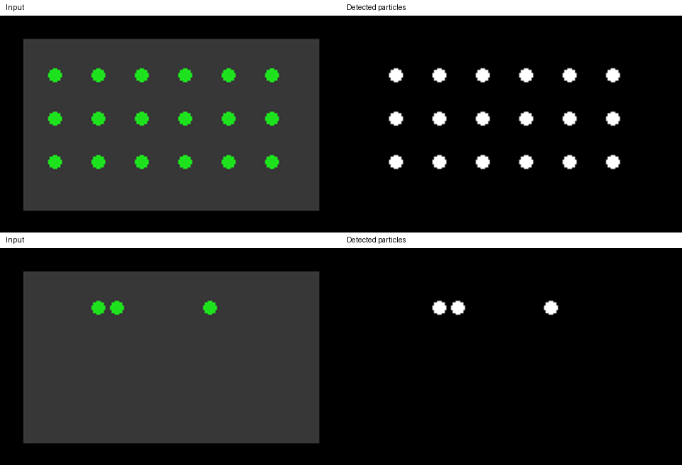

# Particle DRR Visualization｜颗粒识别与除尘率可视化

在颗粒清除实验中，首帧和末帧的对比能说明表面发生了变化，却难以看出变化发生的时间和速率。逐帧统计同一观察区域内的颗粒覆盖面积，可以把视频转换成随时间变化的覆盖率曲线，也便于检查识别结果是否受到反光、遮挡或光照波动影响。

本项目读取视频或按顺序命名的图像帧，在固定的 ROI 内进行灰度增强和颗粒分割，输出逐帧覆盖率、DRR、首末帧对比图及识别过程 GIF。识别阈值由首帧计算，后续帧沿用同一阈值，便于比较同一段视频的相对变化。

## 用示例运行

安装依赖：`python -m pip install -r requirements.txt`

在项目目录运行：

```powershell
python examples/generate_demo_frames.py
python drr.py --input examples/synthetic_frames --roi-mask examples/synthetic_roi_mask.png --fps 10 --seconds 3 --output results/demo --save-gif
```

示例帧由程序生成，绿色颗粒随时间减少；它只用于演示分析流程，不代表实验结果。运行后可查看 `results/demo/metrics.csv`、`first_last_comparison.png` 和 `recognition_preview.gif`。



## 换成自己的数据

```powershell
python drr.py --input "D:/你的实验/视频.mp4" --roi-mask "D:/你的实验/roi_mask.png" --output results/experiment --save-gif
```

ROI 掩膜必须与视频帧尺寸相同；白色为统计区域，黑色不计入。若没有掩膜，程序暂用首帧的非黑像素作为 ROI，这只适合已遮罩的视频。视频 FPS 由文件读取；图像帧文件夹要用 `--fps` 指定实际采样率。默认分析前 10 秒，可用 `--seconds` 调整。

定义：`R_t = 识别为颗粒的 ROI 像素数 / ROI 像素总数`，`DRR_t=(R_0-R_t)/R_0`，`CRR_t=1-R_t`。如果首帧无颗粒，DRR 留空，因为分母为零。

## 使用边界

这里的 DRR 由图像中的面积覆盖率计算，是固定拍摄条件下的视觉指标，不等同于颗粒质量或实际除尘效率。真实视频应提供可靠的 ROI、帧率，并人工检查部分分割帧；光照变化、反光、遮挡以及颗粒重叠都会影响结果。
